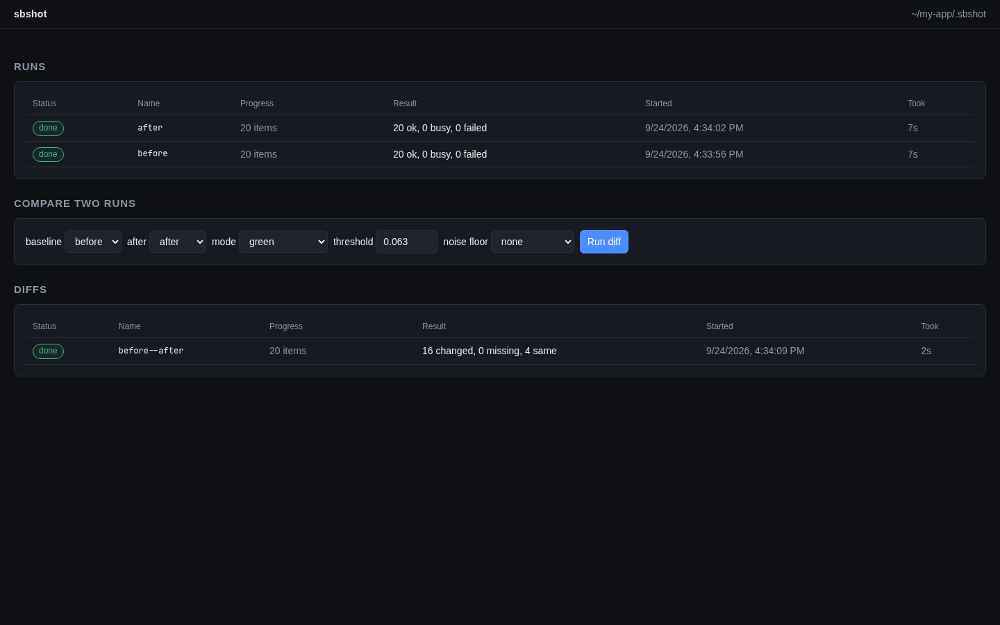
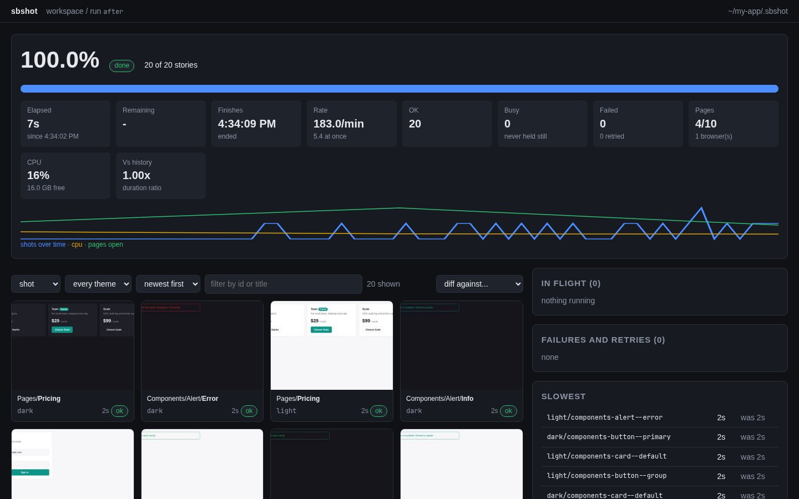
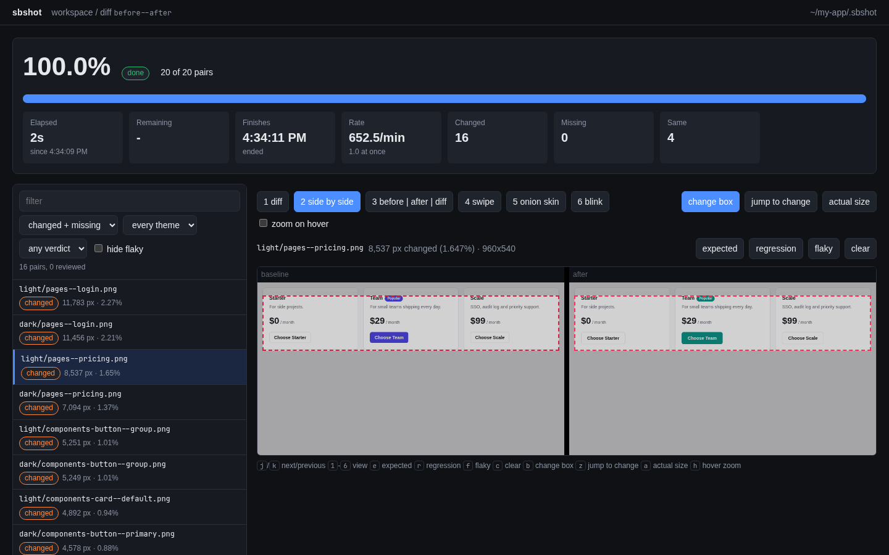

# sbshot

Screenshot every Storybook story, compare two sets of screenshots pixel by
pixel, and review the differences in a local web viewer.

Use it to check what a CSS or component change did to your UI before you
merge it: shoot the stories before the change, shoot them again after, and
look at what moved.

- Works with any Storybook 7 or newer. Point it at a running Storybook, a
  static build, or the project itself.
- Diffs the way Chromatic does (YIQ colour distance, antialiasing ignored),
  so small rendering noise does not show up as a change.
- The viewer shows each changed story side by side, as a swipe, an onion
  skin or blinking, and lets you mark it expected, a regression or flaky.
- Long runs report progress and an ETA, in the terminal and in the viewer.
- Runs locally. No account, no upload.

| Runs and diffs | A capture | A diff |
| --- | --- | --- |
| [](assets/screenshots/list.png) | [](assets/screenshots/capture.png) | [](assets/screenshots/diff.png) |

## Requirements

- Node.js 22.5 or newer.
- ImageMagick 6 or 7, for the caption on each shot and for diff images.
  Without it captures still work (uncaptioned), but `sbshot diff` does not.

  ```bash
  brew install imagemagick        # macOS
  sudo apt install imagemagick    # Debian, Ubuntu
  sudo pacman -S imagemagick      # Arch
  ```

## Install

```bash
npm install -g @signozhq/sbshot
npx playwright install chromium
```

The second line downloads the Chromium build Playwright drives. If that is
not possible, sbshot falls back to an installed Google Chrome, and
`CHROME_PATH=/path/to/browser` picks any other Chromium-based binary.

Check the install:

```bash
sbshot --help
```

To run it without a global install, use `npx @signozhq/sbshot <command>`.

## Quick start

Run these from your Storybook project (the directory with `.storybook/`).

```bash
# 1. Before your change: build Storybook and shoot every story
sbshot capture . --name-run before

# 2. Make your change, then shoot again
sbshot capture . --name-run after

# 3. Compare the two and open the viewer
sbshot diff before after --ui
```

The terminal lists the changed stories, largest change first. The viewer
opens on `http://127.0.0.1:7007`, where you can step through them.

Everything sbshot writes goes to `./.sbshot` in the current directory. Add it
to your `.gitignore`:

```bash
echo .sbshot/ >> .gitignore
```

A few more things you will likely want:

```bash
# only some stories, in two themes
sbshot capture . --name-run before --title Pages/ --theme dark,light

# shoot a Storybook that is already running
sbshot capture http://localhost:6006 --name-run before

# only the stories your branch touched since main
sbshot capture . --name-run after --changed-since main

# follow a run in progress
sbshot status --watch
```

For themes to work, your Storybook preview must read the `theme` global. See
[docs/storybook-setup.md](docs/storybook-setup.md).

## Commands

| Command | What it does |
| --- | --- |
| `sbshot capture <storybook>` | shoot stories from a URL, a build directory, or a project |
| `sbshot list <storybook>` | print the stories a capture would shoot |
| `sbshot modes <storybook>` | print the themes and other globals the preview offers |
| `sbshot diff <before> <after>` | compare two runs |
| `sbshot status [job]` | progress, ETA and failures of a run or diff |
| `sbshot runs` | list every run and diff |
| `sbshot review [diff]` | read or set verdicts on a diff |
| `sbshot tag <diff> <tag>[,<tag>...] <pair>...` | group pairs under tags the viewer filters by, one or several at a time |
| `sbshot ui` | start the viewer |
| `sbshot export [job...]` | write diffs and runs as a static site to host anywhere |
| `sbshot rm <job>...` | delete runs or diffs |
| `sbshot init`, `sbshot link` | add results made elsewhere to the workspace |

`sbshot <command> --help` lists every option.

## Documentation

- [Usage](docs/usage.md): workflows, options, the viewer, exit codes and
  environment variables.
- [Storybook setup](docs/storybook-setup.md): themes, a frozen clock,
  stopping animations, and other ways to get stable screenshots.
- [Output files](docs/files.md): what sbshot writes, for scripts that read
  the results.
- [Architecture](docs/architecture.md): how the code is organised.

## Use it from a coding agent

The package ships an [Agent Skills](https://agentskills.io) guide in
`skills/sbshot/`. It teaches an agent such as Claude Code how to plan a
comparison, run captures in the background, hand you the viewer, and read
the diff.

Link it into your Claude Code skills:

```bash
mkdir -p ~/.claude/skills
ln -s "$(npm root -g)/@signozhq/sbshot/skills/sbshot" ~/.claude/skills/sbshot
```

Start a new session. The agent loads the skill when you ask for something
like "take a visual baseline" or "compare before and after this change", and
`/sbshot` loads it by name. Other agents that read the Agent Skills format
take the same directory.

## Development

```bash
git clone https://github.com/SigNoz/sbshot.git
cd sbshot
pnpm install
npx playwright install chromium
pnpm link --global   # puts this checkout's sbshot on your PATH
pnpm test
pnpm run fmt:fix     # oxfmt; `pnpm run fmt` only checks
pnpm run lint        # oxlint
pnpm run publint     # the package as npm would publish it
```

CI (`.github/workflows/jsci.yaml`) runs the tests on Node 22 and 24, the
format check, the linter and publint on every pull request to `master`.

The tests cover the pixel maths, progress and ETA, the workspace and the
viewer's server. For changes to capture, also run a real capture on a few
stories and diff that run against itself: every pair must come out `same`.

```bash
sbshot capture <storybook> --name-run check --stories <a few ids>
sbshot diff check check
```

## License

[AGPL-3.0](LICENSE)
